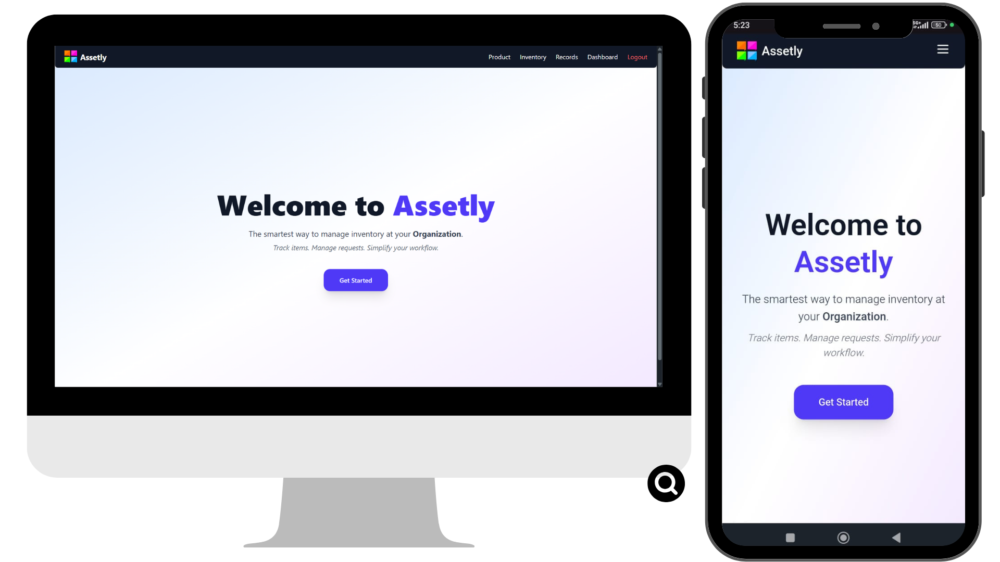
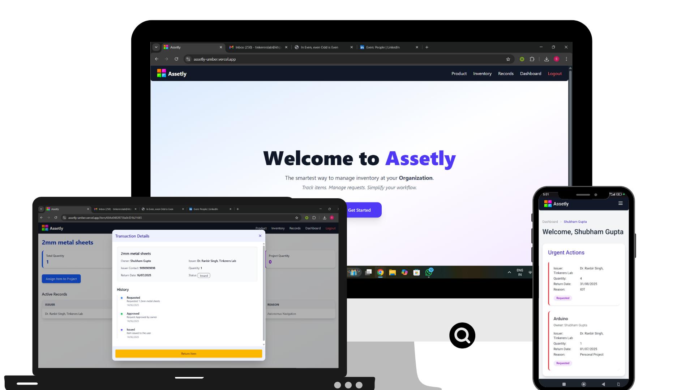

<table>
  <tr>
    <td>
      <h1>Assetly – Inventory Management Web App</h1>
      
<strong>Assetly</strong> is a modern, full-stack <strong>inventory management</strong> application built with the <strong>MERN stack</strong> (MongoDB, Express.js, React.js, Node.js). Designed for teams, clubs, labs, and organizations, Assetly enables users to <strong>lend, borrow, and track assets</strong> ,such as tools, electronics, books, or lab equipment—with an intuitive UI and smart automation features.

    </td>
    <td align="right">
      
    </td>
  </tr>
</table>

---

## 🌐 Live Demo

🔗 [https://assetly-umber.vercel.app/](https://assetly-umber.vercel.app/)  
⚠️ Note: The backend is hosted on a free tier and may take up to **1 minute** to respond after periods of inactivity and is only available to users with a valid IIT ROPAR email.

---

## ✨ Features

- 🔁 **Asset Request & Return Workflow**  
  Streamlined asset management: request, approve, reject, return—all with status tracking.

- 📬 **Automated Email Notifications**  
  Uses Nodemailer to send real-time updates, reminders, and overdue alerts.

- 🔐 **Secure Authentication**  
  Google OAuth integration with JWT-based session management for seamless login.

- ⏰ **Daily Cron Jobs**  
  Scheduled tasks run automatically to identify overdue items and send notifications.

- 👥 **Team Collaboration**  
  Inventory management for clubs, labs, and teams.

---

## 🖼️ Preview

  
_A clean and responsive interface built using Tailwind CSS, DaisyUI, and React._

---

## 🧑‍💻 Tech Stack

**Frontend:**
- React.js  
- Tailwind CSS  
- DaisyUI  
- Framer Motion

**Backend:**
- Node.js  
- Express.js  
- MongoDB + Mongoose

**Other Tools:**
- Google OAuth 2.0  
- JWT (JSON Web Tokens)  
- Nodemailer  
- node-cron

---

## 👤 About the Author

Developed by [**Shubham Gupta**](https://github.com/shubhamgupta1017)  
🔗 [LinkedIn](https://www.linkedin.com/in/shubham259gupta/)

---

## 📜 License

This project is licensed under the [MIT License](https://chatgpt.com/c/LICENSE).

---
